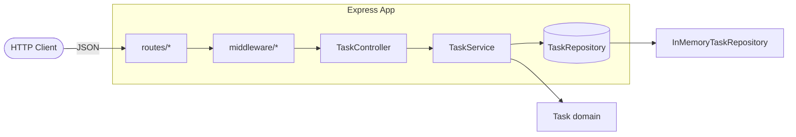

# docker-ci-cd-demo

[](https://github.com/MSeyyidDev/docker-ci-cd-demo/actions/workflows/ci.yml)
[](https://github.com/MSeyyidDev/docker-ci-cd-demo/actions/workflows/docker.yml)
[](https://nodejs.org/)
[](LICENSE)

A focused, portfolio-grade demo of **Docker** + **GitHub Actions CI/CD** built around a small but real **Node.js + TypeScript + Express** Task API. The application is intentionally compact — the showpiece is the pipeline, the image, and the layered architecture.

> **TL;DR** — A clean, layered Task API (domain / repository / service / controller / route) shipped through a multi-stage Docker image and validated by a Node 20 + 22 CI matrix and a Docker smoke-test workflow.

---

## Why this repo exists

This project answers a single question for reviewers:

> Can the author take a small, well-structured TypeScript service from zero to a production-shaped container with green CI?

It deliberately keeps the domain trivial (CRUD on tasks with priority and due date) so attention can stay on:

- A clean **OO layering** (`domain` → `repository` → `service` → `controller` → `routes`).
- **Strict TypeScript**, **Zod**-validated request bodies, and structured error responses.
- A **multi-stage Dockerfile** running as a non-root user with a real `HEALTHCHECK`.
- Two **GitHub Actions** workflows: a Node 20+22 CI matrix and a Docker build + smoke test.

---

## Architecture



Every layer depends only on the layer below via an interface, which is why swapping `InMemoryTaskRepository` for a Postgres-backed repository would not require touching the controller, the service, or the domain.

---

## API

| Method | Path                  | Description                            | Success | Failure           |
| ------ | --------------------- | -------------------------------------- | ------- | ----------------- |
| GET    | `/health`             | Liveness probe                         | 200     | -                 |
| GET    | `/tasks`              | List all tasks (newest first)          | 200     | -                 |
| POST   | `/tasks`              | Create a task (Zod validated body)     | 201     | 400 on validation |
| GET    | `/tasks/:id`          | Fetch a single task                    | 200     | 404 if missing    |
| PUT    | `/tasks/:id`          | Patch any subset of mutable fields     | 200     | 400 / 404         |
| DELETE | `/tasks/:id`          | Delete a task                          | 204     | 404 if missing    |
| POST   | `/tasks/:id/complete` | Convenience endpoint to mark completed | 200     | 404 if missing    |

All errors follow this shape:

```json
{
  "error": {
    "code": "VALIDATION_ERROR",
    "message": "Request body failed validation.",
    "issues": [{ "path": "title", "message": "title must be a non-empty string" }]
  }
}
```

A `Task` looks like this:

```json
{
  "id": "9d1e...",
  "title": "Write tests",
  "description": "Cover the API surface.",
  "priority": "high",
  "status": "open",
  "dueDate": "2026-05-15T00:00:00.000Z",
  "createdAt": "2026-05-09T00:00:00.000Z",
  "updatedAt": "2026-05-09T00:00:00.000Z",
  "completedAt": null
}
```

The store is seeded with 20 plausible tasks at startup so the API is never empty when demoed.

---

## Local development

```bash
# 1. Install dependencies
npm install

# 2. Run the dev server (auto-reload via tsx)
npm run dev

# 3. Run the test suite (Vitest + Supertest)
npm test

# 4. Lint and format
npm run lint
npm run format:check

# 5. Build to dist/
npm run build
```

Available scripts:

| Script                 | Purpose                          |
| ---------------------- | -------------------------------- |
| `npm run dev`          | Live-reload dev server via `tsx` |
| `npm run build`        | TypeScript compile to `dist/`    |
| `npm run start`        | Run the compiled server          |
| `npm test`             | Vitest in CI mode                |
| `npm run test:watch`   | Vitest in watch mode             |
| `npm run lint`         | ESLint flat config               |
| `npm run format`       | Prettier write                   |
| `npm run format:check` | Prettier verify                  |
| `npm run typecheck`    | TypeScript no-emit check         |

---

## Docker

The image is built in two stages: a `node:22-alpine` builder that compiles the TypeScript and prunes dev dependencies, and a slim runtime that copies just `node_modules` and `dist`, runs as the built-in non-root `node` user, and ships with `tini` as PID 1 plus `curl` for the `HEALTHCHECK`.

```bash
# Build directly
docker build -t docker-ci-cd-demo .

# Or use Compose
docker compose up --build
```

Then:

```bash
curl http://localhost:3000/health
curl http://localhost:3000/tasks
```

Stop with `docker compose down`.

---

## 5-minute API demo

```bash
curl -s http://localhost:3000/health
curl -s http://localhost:3000/tasks

curl -s -X POST http://localhost:3000/tasks \
  -H "Content-Type: application/json" \
  -d '{"title":"Ship portfolio demo","priority":"high","dueDate":"2026-05-15T00:00:00.000Z"}'

curl -s -X POST http://localhost:3000/tasks/<id>/complete
curl -i -X DELETE http://localhost:3000/tasks/<id>
```

Use the `id` returned by the create request for the complete/delete calls.

---

## CI/CD

Two workflows live under `.github/workflows/`:

### `ci.yml` — Lint, test, build (matrix Node 20 + 22)

Runs on every push and PR to `main`:

1. **Checkout** with `actions/checkout@v4`.
2. **Set up Node** with `actions/setup-node@v4` using the built-in `npm` cache.
3. **`npm ci`** for a deterministic install from the lockfile.
4. **`npm run lint`** — ESLint flat config.
5. **`npm run format:check`** — Prettier in verify mode.
6. **`npm run test -- --coverage`** — Vitest with V8 coverage and an 80% threshold.
7. **`npm run build`** — TypeScript compile.
8. Coverage from the Node 22 leg is uploaded as an `actions/upload-artifact@v4` artifact.

### `docker.yml` — Build the image and smoke-test it

Runs on every push to `main` and on manual `workflow_dispatch`:

1. **Buildx** is enabled with `docker/setup-buildx-action@v3`.
2. **`docker/build-push-action@v5`** builds the image with `push: false` and `load: true` so it stays available locally; tags include the short SHA and `latest`. GitHub Actions cache is wired in via `cache-from`/`cache-to`.
3. The container is launched and **smoke-tested**: a small loop polls `GET /health` until it returns `200`, then `GET /tasks` is also hit to make sure the seeded data is reachable.
4. Image size is printed for awareness, then the container is torn down.

> The Docker workflow intentionally does **not** push to a registry — this repo is a demo. Wiring `push: true` to GHCR is one line plus a `permissions: { packages: write }` block.

### Suggested screenshot spots

Drop screenshots of green Actions runs into `docs/screenshots/` and reference them here:

- `docs/screenshots/ci-green.png` — the matrix CI run.
- `docs/screenshots/docker-green.png` — the Docker smoke-test run.

---

## Project layout

```
docker-ci-cd-demo/
  src/
    domain/Task.ts                  # invariants and shape of a Task
    repositories/
      TaskRepository.ts             # interface (the persistence boundary)
      InMemoryTaskRepository.ts     # default impl
    services/
      TaskService.ts                # application use cases
      errors.ts                     # AppError / TaskNotFoundError / ValidationError
    schemas/taskSchemas.ts          # Zod request schemas
    controllers/TaskController.ts   # HTTP boundary
    routes/{tasks,health}.ts        # router wiring
    middleware/{errorHandler,requestLogger,validateBody}.ts
    seed/seedTasks.ts               # 20-row startup seed
    app.ts                          # createApp factory used by tests
    server.ts                       # production entrypoint
    logger.ts                       # pino logger
  tests/                            # Vitest + Supertest
  Dockerfile
  docker-compose.yml
  .github/workflows/{ci,docker}.yml
```

---

## Contributing

Pull requests welcome. A few ground rules:

- All code, comments, and commit messages in **English**.
- Use **Conventional Commits** (`feat:`, `fix:`, `chore:`, `docs:`, `test:`, `refactor:`, `ci:`).
- Run `npm run lint && npm run format:check && npm test` before opening the PR.
- Keep the layering: HTTP code stays in `controllers/`, application logic in `services/`, persistence behind `TaskRepository`.

---

## License

MIT — see [LICENSE](LICENSE).
